# 📊 IPO Web Application & REST API

This project was developed during my internship at **Bluestock Fintech** as a full-stack web application to manage and display IPO (Initial Public Offering) information. It includes:

- ✅ Public user interface (IPO listings & detail pages)  
- ✅ Admin dashboard for IPO management  
- ✅ JWT-secured REST API using Django REST Framework

---

## 🧑‍💻 Intern Info

- **Intern:** CHEERALA KONA MANOJ KUMAR  
- **Company:** Bluestock Fintech  
- **Department:** #BF-SOFT-DEV  
- **Manager:** Yash Kale  
- **Internship Period:** June – July 2025  
- **Submission Date:** July 3, 2025  
- **Website:** [www.bluestock.in](https://www.bluestock.in)

---

## 🎯 Objective

To build a secure, responsive, and API-driven IPO information system with:

- Public listing of IPOs with detail pages  
- Admin tools for creating/editing IPOs  
- Upload support for logos, RHP/DRHP PDFs  
- JWT-protected REST API for integration

---

## ⚙️ Technologies Used

- Python 3.12.3  
- Django 5.0.6  
- Django REST Framework (DRF)  
- PostgreSQL  
- Bootstrap 5, HTML, CSS, JavaScript  
- JWT Authentication (SimpleJWT)  
- Postman (API Testing)  
- Git, GitHub, VS Code

---

## ✨ Features

### 🔓 Public Interface
- IPO homepage with filter/search
- IPO detail page with PDF download links
- Mobile responsive (Bootstrap)

### 🔐 Admin Dashboard
- Secure login, register, logout
- Add/Edit/Delete IPOs with media upload
- Password reset and change features

### 🛡️ API & Security
- JWT token-based authentication
- Public + protected API endpoints
- Tested with Postman

---

## 🗂️ Project Structure (Simplified)

ipo_project/
├── ipo_app/
│   ├── models.py
│   ├── views.py
│   ├── serializers.py
│   └── urls.py
├── templates/
│   ├── home.html
│   └── detail.html
├── media/
│   ├── logos/
│   └── docs/
├── static/
├── requirements.txt
├── README.md
└── manage.py

<<<<<<< HEAD
=======

>>>>>>> 392a89f5850fe68941902b3dd48a4636b61c3a57
---

## 🖼️ Screenshots

---

## 🖼️ Screenshots

### 1. Homepage - IPO Listings
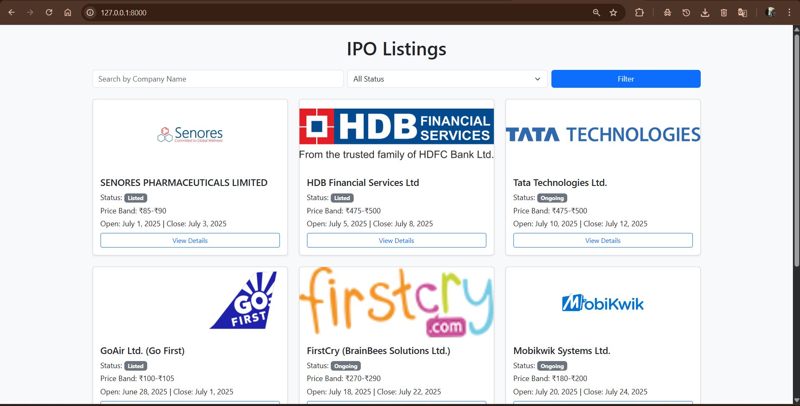

### 2. IPO Detail Page
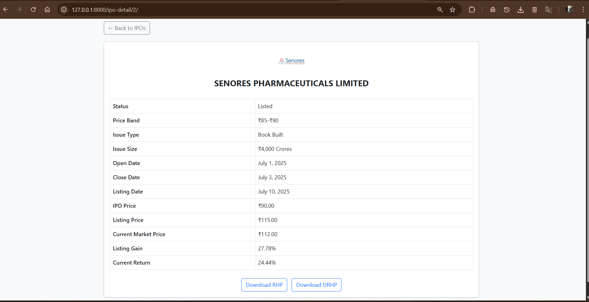

### 3. Admin Dashboard Overview
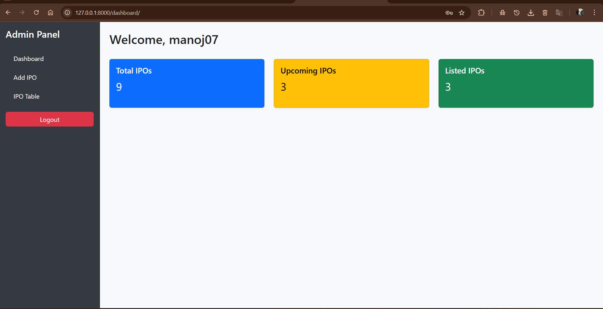

### 4. Add IPO Form
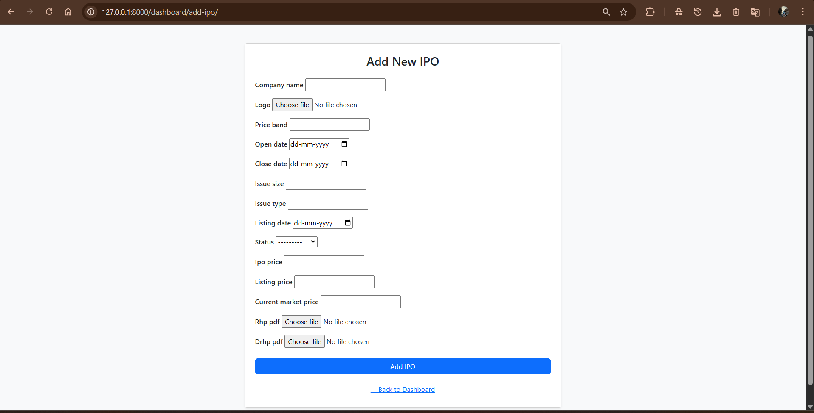

### 5. Edit IPO Form
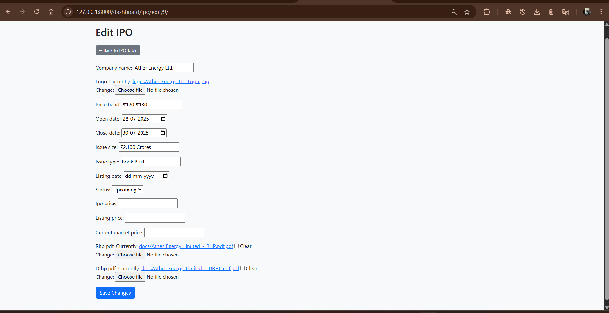

### 6. Login Page
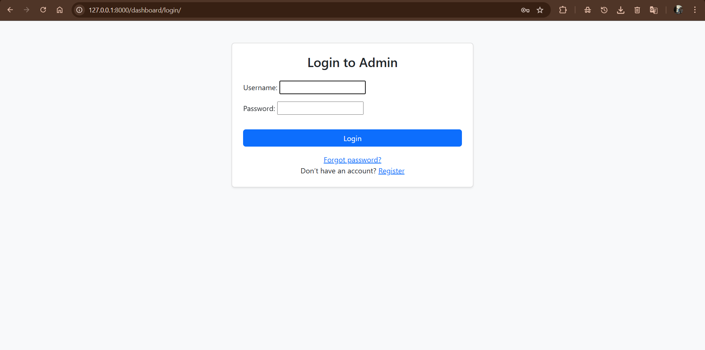

### 7. Register Page
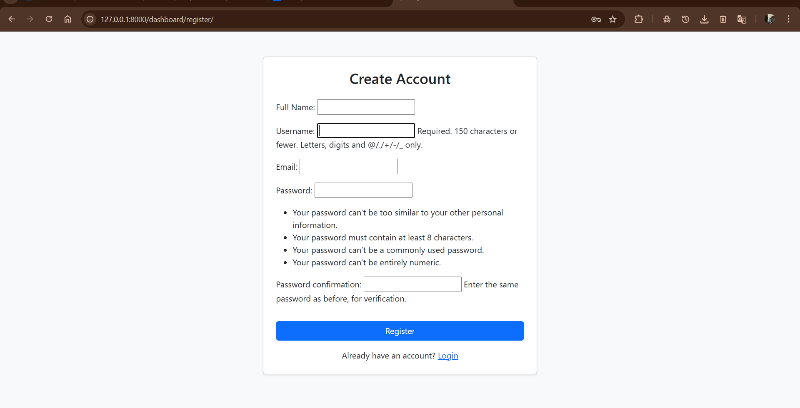

### 8. Password Reset Page
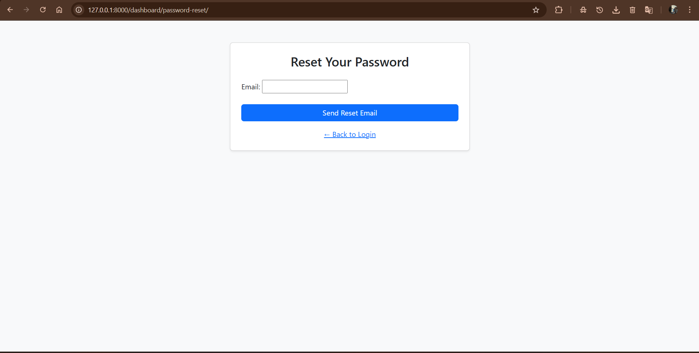

### 9. Reset Email Sent Confirmation

### 10. Password Change Page
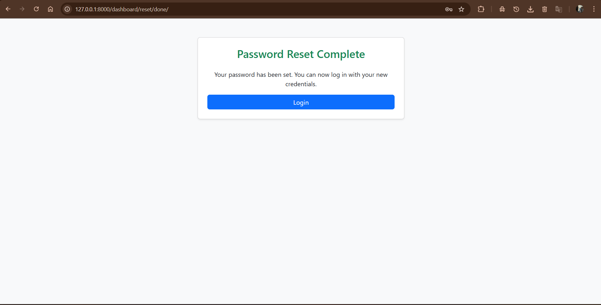

### 11. Postman - JWT Token Response
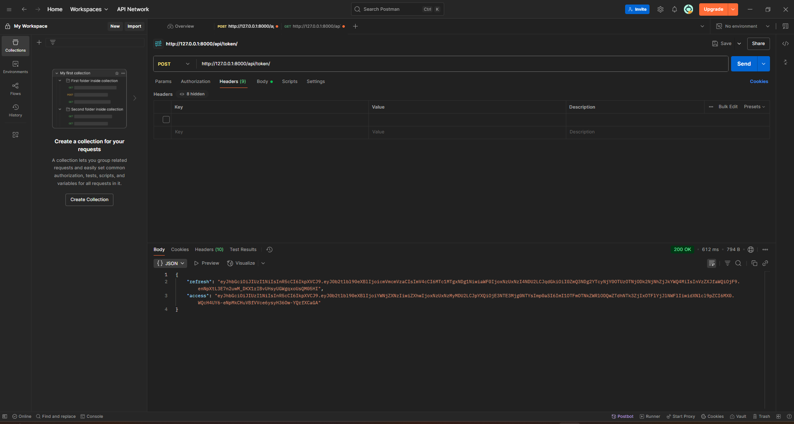

### 12. Postman - API JSON Preview
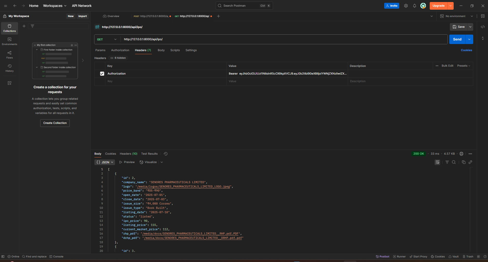

### 13. GitHub Repository Overview
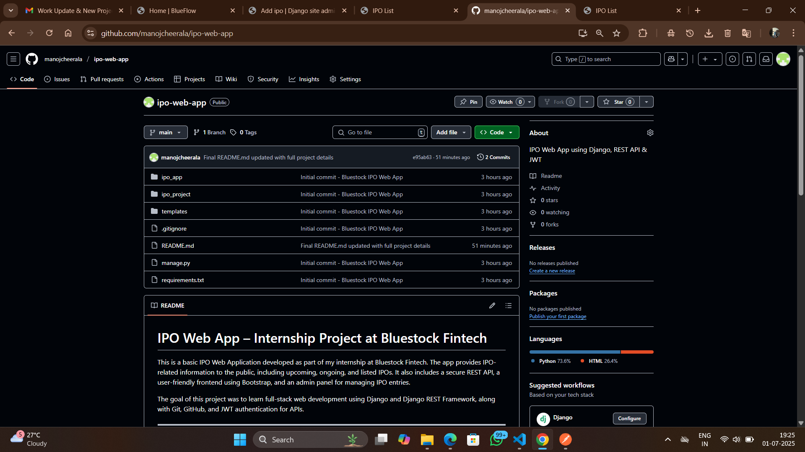

---

---

## ✅ Final Status

- ✅ Matches all **Figma Component 2** UI requirements  
- ✅ Fully mobile responsive (tested on Chrome & mobile view)  
- ✅ Screenshots and media tested  
- ✅ Working password flows & JWT API  
- ✅ All features committed to GitHub

---

## 🔗 GitHub Repository  
[https://github.com/manojcheerala/ipo-web-app](https://github.com/manojcheerala/ipo-web-app)

---

## 🙏 Acknowledgment  
Thanks to **Bluestock Fintech** and my manager **Yash Kale** for the opportunity and support during this internship.

---

> 📁 _This README was last updated on July 5, 2025._
